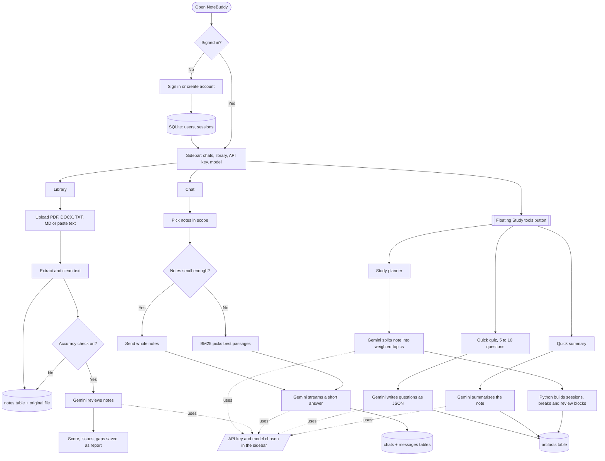
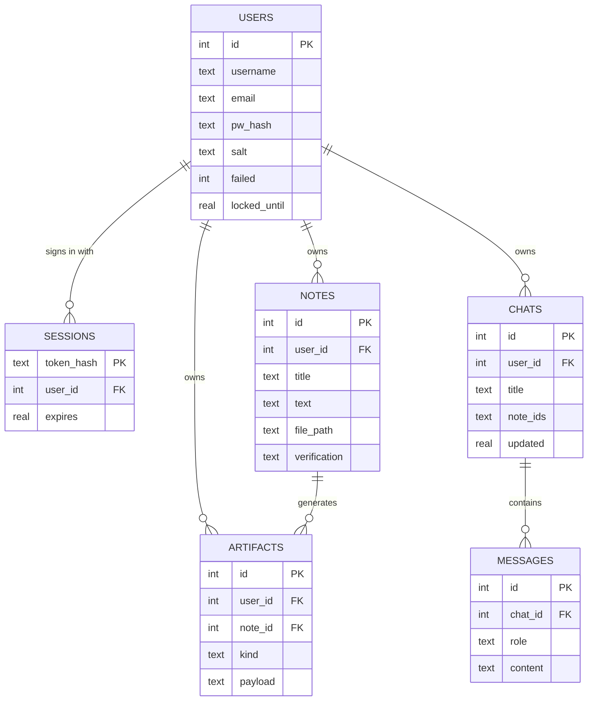

# NoteBuddy architecture

## How a request flows

```mermaid
flowchart TD
    A([Open NoteBuddy]) --> B{Signed in?}
    B -- No --> C[Sign in or create account]
    C --> D[(SQLite: users, sessions)]
    D --> E
    B -- Yes --> E[Sidebar: chats, library, API key, model]

    E --> F[Library]
    E --> G[Chat]
    E --> H[[Floating Study tools button]]

    F --> F1[Upload PDF, DOCX, TXT, MD or paste text]
    F1 --> F2[Extract and clean text]
    F2 --> F3[(notes table + original file)]
    F2 --> F4{Accuracy check on?}
    F4 -- Yes --> F5[Gemini reviews notes]
    F5 --> F6[Score, issues, gaps saved as report]
    F4 -- No --> F3

    G --> G1[Pick notes in scope]
    G1 --> G2{Notes small enough?}
    G2 -- Yes --> G3[Send whole notes]
    G2 -- No --> G4[BM25 picks best passages]
    G3 --> G5[Gemini streams a short answer]
    G4 --> G5
    G5 --> G6[(chats + messages tables)]

    H --> H1[Quick quiz, 5 to 10 questions]
    H --> H2[Quick summary]
    H --> H3[Study planner]
    H1 --> I[Gemini writes questions as JSON]
    H2 --> J[Gemini summarises the note]
    H3 --> K[Gemini splits note into weighted topics]
    K --> L[Python builds sessions, breaks and review blocks]
    I --> M[(artifacts table)]
    J --> M
    L --> M

    K -. uses .-> N[/API key and model chosen in the sidebar/]
    F5 -. uses .-> N
    G5 -. uses .-> N
    I -. uses .-> N
    J -. uses .-> N
```

## Data model

```mermaid
erDiagram
    USERS ||--o{ SESSIONS : "signs in with"
    USERS ||--o{ NOTES : owns
    USERS ||--o{ CHATS : owns
    USERS ||--o{ ARTIFACTS : owns
    CHATS ||--o{ MESSAGES : contains
    NOTES ||--o{ ARTIFACTS : "generates"

    USERS {
        int id PK
        text username
        text email
        text pw_hash
        text salt
        int failed
        real locked_until
    }
    SESSIONS {
        text token_hash PK
        int user_id FK
        real expires
    }
    NOTES {
        int id PK
        int user_id FK
        text title
        text text
        text file_path
        text verification
    }
    CHATS {
        int id PK
        int user_id FK
        text title
        text note_ids
        real updated
    }
    MESSAGES {
        int id PK
        int chat_id FK
        text role
        text content
    }
    ARTIFACTS {
        int id PK
        int user_id FK
        int note_id FK
        text kind
        text payload
    }
```
